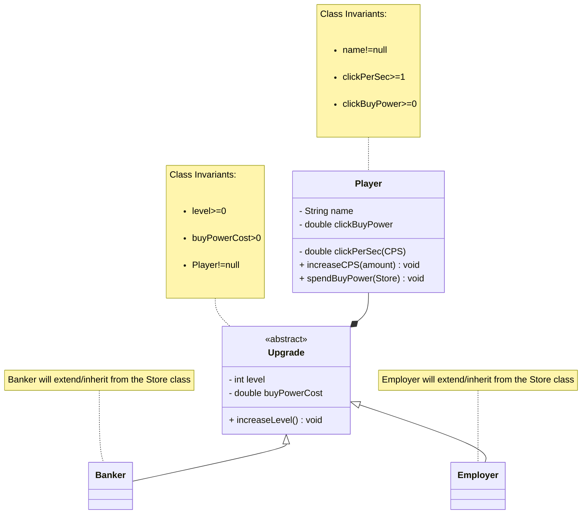

# Domain Model

```mermaid

classDiagram

class Player {
    - String name
    - double clickPerSec(CPS)
    - double clickBuyPower
    + increaseCPS(amount) void
    + spendBuyPower(Store) void
    }
    
    note for Player "Class Invariants:
    <ul>
    <li>name!=null</li>
    <li>clickPerSec>=1</li>
    <li>clickBuyPower>=0</li>
    </ul>"

     class Upgrade {
         <<abstract>>
         - int level
         - double buyPowerCost
         + increaseLevel() void
     }
    note for Upgrade "Class Invariants:
    <ul>
    <li>level>=0</li>
    <li>buyPowerCost>0</li>
    <li>Player!=null</li>
    </ul>"
    
     note for Banker "Banker will extend/inherit from the Store class"
     
     class Banker {
     }
     
     note for Employer "Employer will extend/inherit from the Store class"
     class Employer {
     }
     
    Player --* Upgrade
    Upgrade <|-- Banker
    Upgrade <|-- Employer
    
```
