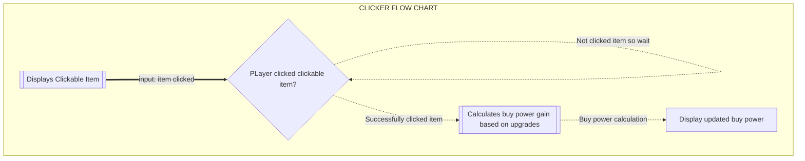
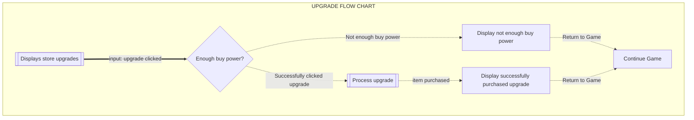

# Flows of interaction

```mermaid
flowchart TD
    subgraph CLICKER FLOW CHART
        display[[Displays Clickable Item]]
        calculate[[Calculates buy power gain based on upgrades]]
        updatedBP[Display updated buy power]
        display-result{PLayer clicked clickable item?}
        display ==input: item clicked===> display-result
        display-result -.Successfully clicked item.-> calculate
        display-result -.Not clicked item so wait.-> display-result
        calculate-.Buy power calculation.->updatedBP
        end
```
## Upgrade Flow Chart

```mermaid
flowchart TD
    subgraph UPGRADE FLOW CHART
        display[[Displays store upgrades]]
        purchase[[Process upgrade]]
        errorDisplay[Display not enough buy power]
        upgraded[Display successfully purchased upgrade]
        continueGame[Continue Game]
        display-result{Enough buy power?}
        display ==input: upgrade clicked===> display-result
        display-result -.Successfully clicked upgrade.-> purchase
        display-result -.Not enough buy power.-> errorDisplay
        errorDisplay-.Return to Game.->continueGame
        purchase-.item purchased.->upgraded
        upgraded-.Return to Game.->continueGame
    end
```

