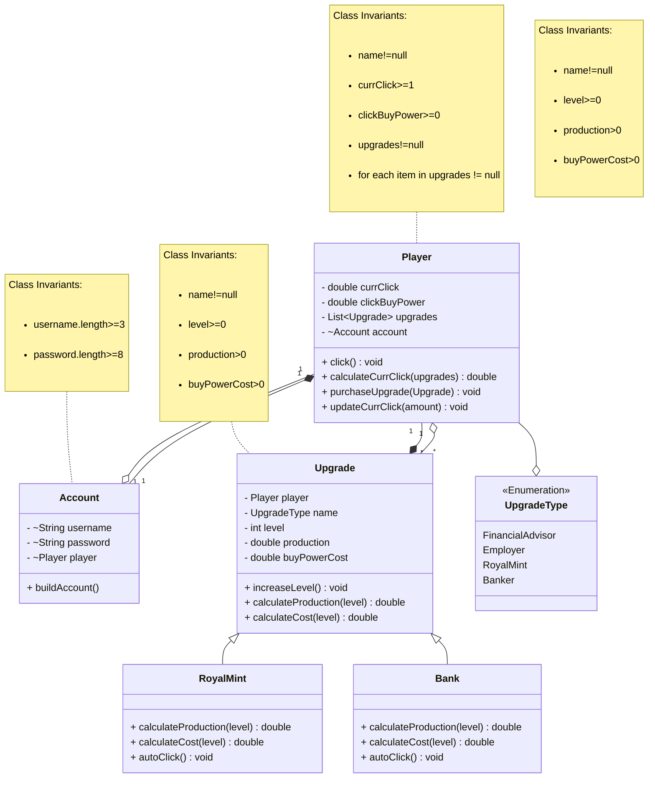

# Domain Model

```mermaid

classDiagram

class Player {
    - double currClick
    - double clickBuyPower
    - List~Upgrade~ upgrades 
    - ~Account account
    + click() void
    + calculateCurrClick(upgrades) double
    + purchaseUpgrade(Upgrade) void
    + updateCurrClick(amount) void
    }
    note for Player "Class Invariants:
    <ul>
    <li>name!=null</li>
    <li>currClick>=1</li>
    <li>clickBuyPower>=0</li>
    <li>upgrades!=null</li>
    <li>for each item in upgrades != null</li>
    </ul>"

    class Account{
        - ~String username
        - ~String password
        - ~Player player
        + buildAccount()
        
    }
    note for Account "Class Invariants:
    <ul>
    <li>username.length>=3</li>
    <li>password.length>=8</li>
    </ul>"
  
     class Upgrade {
         - Player player
         - UpgradeType name
         - int level
         - double production
         - double buyPowerCost
         + increaseLevel() void
         + calculateProduction(level) double
         + calculateCost(level) double

     }
     class UpgradeType {
        <<Enumeration>>
         FinancialAdvisor
         Employer
         RoyalMint
         Banker
 }
    note for Upgrade "Class Invariants:
    <ul>
    <li>name!=null</li>
    <li>level>=0</li>
    <li>production>0</li>
    <li>buyPowerCost>0</li>
    </ul>"
    
    

    Player "1" --* "*" Upgrade
    Upgrade "*"--o "1" Player
    Account "1" --* "1" Player
    Player --o UpgradeType
    Player "1" --o "1" Account
%%    Account --o "1" Player


    Upgrade <|-- RoyalMint
    Upgrade <|-- Bank
     
    class RoyalMint {
        + calculateProduction(level) double
        + calculateCost(level) double
        + autoClick() void
    }
    class Bank {
        + calculateProduction(level) double
        + calculateCost(level) double
        + autoClick() void
    }
    note for Building "Class Invariants:
    <ul>
    <li>name!=null</li>
    <li>level>=0</li>
    <li>production>0</li>
    <li>buyPowerCost>0</li>
    </ul>"


    
```
