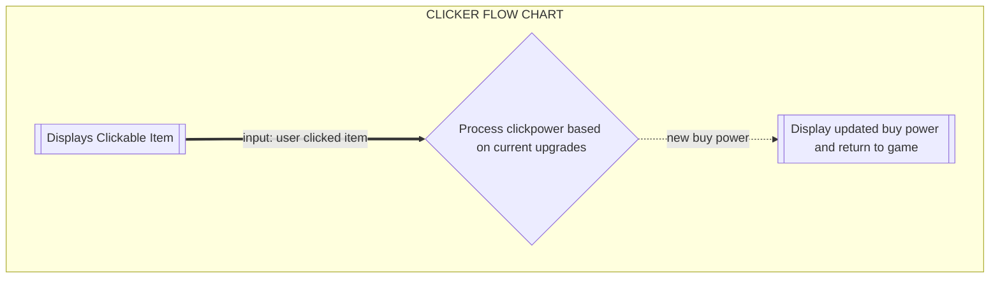
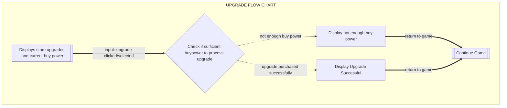
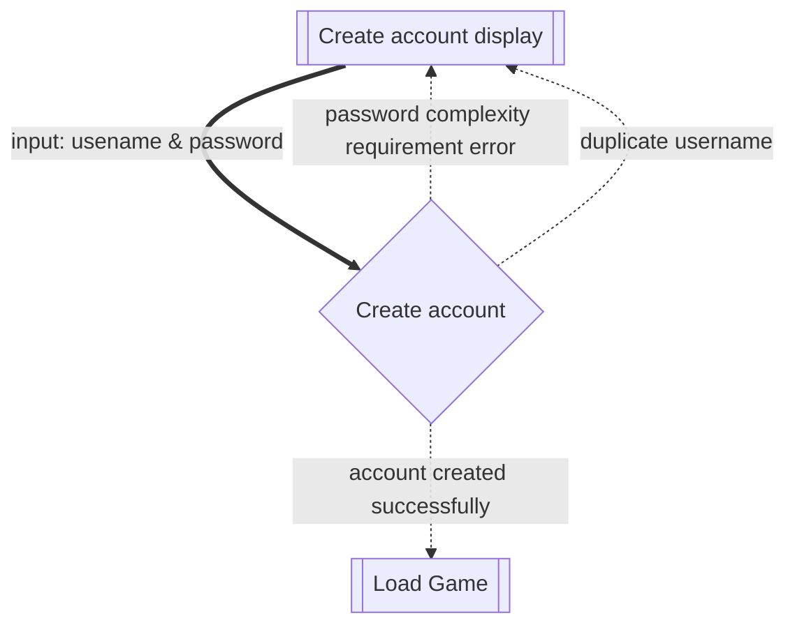

# Flows of interaction

```mermaid
flowchart TD
    subgraph CLICKER FLOW CHART
        display[[Displays Clickable Item]]
        updatedBP[[Display updated buy power and return to game]]
        display-result{Process clickpower based on current upgrades}
        display ==input: user clicked item===> display-result
        display-result-.new buy power.->updatedBP
        
        end

```
## Upgrade Flow Chart

```mermaid
flowchart TD
    subgraph UPGRADE FLOW CHART
        display[[Displays store upgrades and current buy power]]
        errorDisplay[Display not enough buy power]
        continueGame[[Continue Game]]
        display-result{Check if sufficient buypower to process upgrade}
        upgraded[Display Upgrade Successful]
        display == input: upgrade clicked/selected ===> display-result
        display-result -. upgrade purchased successfully .-> upgraded
        display-result -. not enough buy power .-> errorDisplay
        errorDisplay== return to game ===>continueGame
        upgraded== return to game ===>continueGame
    end
```
## User Log in Flow Chart

```mermaid
flowchart TD
    displayLogin[[Create account display]]
    processLogIn{Create account}
    
    displayLogin == input: usename & password ==> processLogIn
    processLogIn -.password complexity requirement error.->displayLogin
    processLogIn -.duplicate username.->displayLogin
    processLogIn -.account created successfully.->continueGame
    continueGame[[Load Game]]
```

