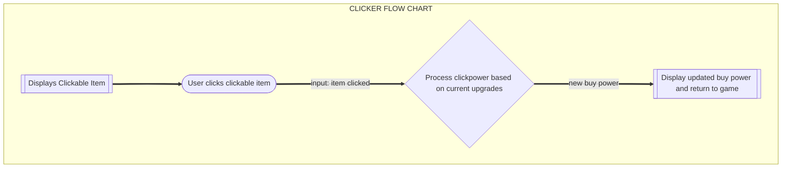
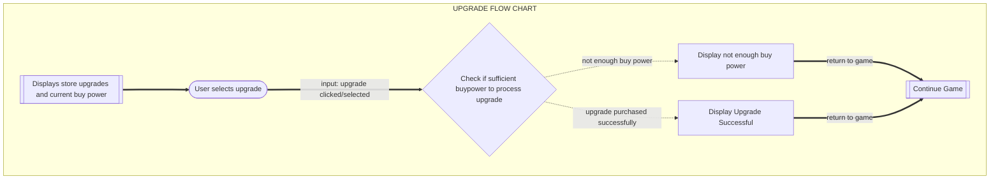

# Flows of interaction

```mermaid
flowchart TD
    subgraph CLICKER FLOW CHART
        display[[Displays Clickable Item]]
        clickItem([User clicks clickable item])
        updatedBP[[Display updated buy power and return to game]]
        display-result{Process clickpower based on current upgrades}
        display===> clickItem
        clickItem ==input: item clicked===> display-result
        display-result==new buy power===>updatedBP
        
        end

```
## Upgrade Flow Chart

```mermaid
flowchart TD
    subgraph UPGRADE FLOW CHART
        display[[Displays store upgrades and current buy power]]
        selectUpgrade([User selects upgrade])
        errorDisplay[Display not enough buy power]
        continueGame[[Continue Game]]
        display-result{Check if sufficient buypower to process upgrade}
        upgraded[Display Upgrade Successful]
        display===> selectUpgrade
        selectUpgrade == input: upgrade clicked/selected ===> display-result
        display-result -. upgrade purchased successfully .-> upgraded
        display-result -. not enough buy power .-> errorDisplay
        errorDisplay== return to game ===>continueGame
        upgraded== return to game ===>continueGame
    end
```

